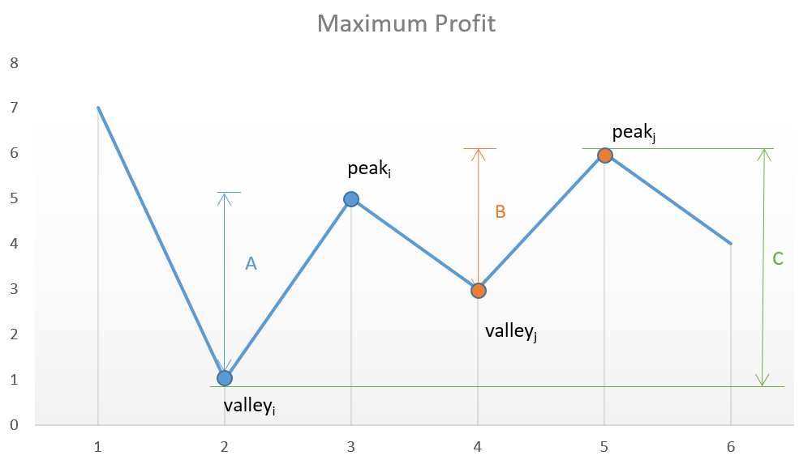

[122. Best Time to Buy and Sell Stock II
](https://leetcode.com/problems/best-time-to-buy-and-sell-stock-ii/)

<code>
You are given an integer array prices where prices[i] is the price of a given stock on the ith day.  

On each day, you may decide to buy and/or sell the stock. You can only hold at most one share of the stock at any time. However, you can buy it then immediately sell it on the same day.  

Find and return the maximum profit you can achieve.

Example 1:  
Input: prices = [7,1,5,3,6,4]  
Output: 7  
Explanation: Buy on day 2 (price = 1) and sell on day 3 (price = 5), profit = 5-1 = 4.  
Then buy on day 4 (price = 3) and sell on day 5 (price = 6), profit = 6-3 = 3.  
Total profit is 4 + 3 = 7.  

Example 2:  
Input: prices = [1,2,3,4,5]  
Output: 4  
Explanation: Buy on day 1 (price = 1) and sell on day 5 (price = 5), profit = 5-1 = 4.  
Total profit is 4.  

Example 3:  
Input: prices = [7,6,4,3,1]  
Output: 0  
Explanation: There is no way to make a positive profit, so we never buy the stock to achieve the maximum profit of 0.  

Constraints:  
1 <= prices.length <= 3 * 104  
0 <= prices[i] <= 104
</code>

  
中文意思

> 給一組prices int array, 其中prices[i]表示當天股票的價格.  
> 目標是實現的最大利潤
> 每一天都可以買入跟賣出股票, 但一天最大只能持有一檔股票
> 可以購買它, 且當天就賣出  
> 如果無法獲得利潤, 則返回0  
# 買低賣高!

直覺上很像是要找一組最佳解, 每個值都往後看最優的價格做賣出, 但也要考慮到其他的值.
很是麻煩~主要是這樣要把所有情況都跑一次, Time complexity O(nn),  Space complexity O(nn)

我觀察example2 , prices = [1,2,3,4,5]  
他的1在Day1買入, 例子說在Day5賣出, 得到利潤4
但其實好像也能今天的值大於昨天的值做賣掉, 再買入, 反覆操作
也是能得到一樣的結果

也在思考要是刻意跳過一個谷峰, 會不會讓利潤更高

但這樣反而少一次買賣的機會, 其實沒比較賺

example2的例子其實也能看成
Day1買入,隔天賣出, 又買入;
這樣反覆操作

再次印證 
# 買低賣高!

